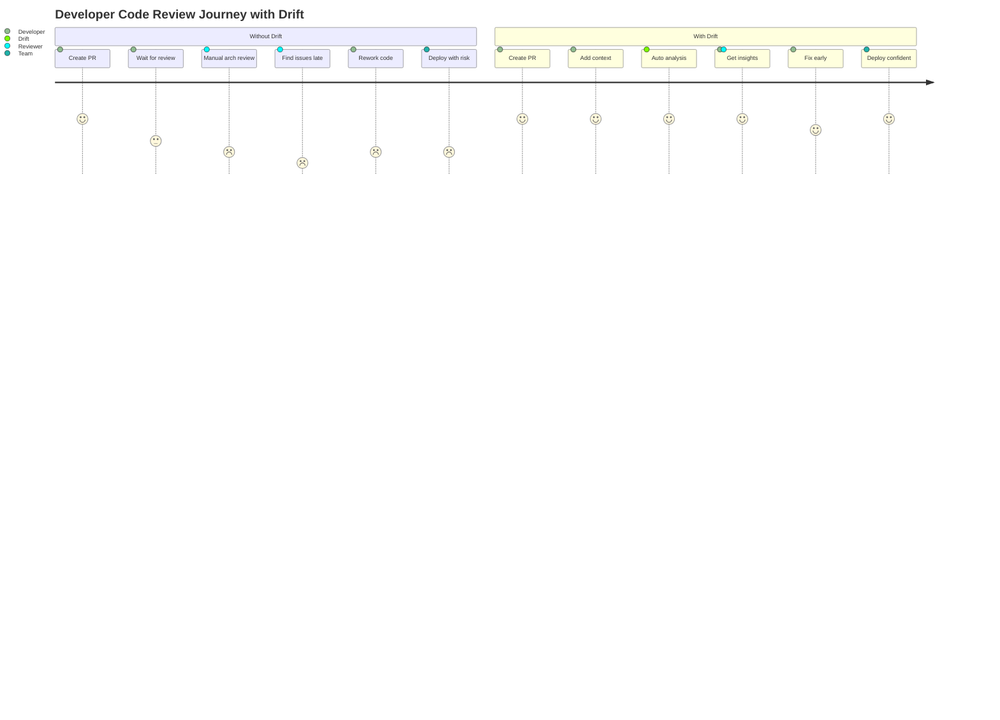

# Project Specification

**Scope**: AI-powered architectural code review for GitHub and GitLab

## Problem Statement

**Code reviews lack business context and architectural insight.** Reviewers see code changes but don't understand why changes are being made (business requirements) or what will be affected architecturally (system dependencies and ripple effects). This leads to incomplete reviews that miss important architectural implications.

**Current reality**: Code reviews focus on syntax and style while missing business alignment and architectural impact that could prevent production issues.

## Solution Overview

**AI-powered code reviewer for GitHub and GitLab that combines Git diffs with business context to provide architectural impact analysis.** Runs as optional GitLab CI/GitHub Actions pipeline stage, posting single comprehensive review comment with before/after dependency visualization and business-context-aware recommendations. Supports any LLM provider through unified interface.

**Platform Support**: GitHub and GitLab only (no Bitbucket, Azure DevOps, or other platforms in MVP)

## Target Users

**Primary**: Developers using GitHub or GitLab who want architectural insights
**Secondary**: Open source maintainers reviewing community contributions
**Tertiary**: Teams wanting to understand code impact before merging

**Requirements**:

- GitHub or GitLab repository
- Any LLM provider API access
- CI/CD pipeline (GitHub Actions or GitLab CI)

## Core Features

**Platform Integration (GitHub & GitLab Only)**:

- GitHub PR and GitLab MR metadata extraction
- Git diff analysis for changed files
- Comment posting via GitHub/GitLab APIs
- CI/CD integration (GitHub Actions & GitLab CI)

**Context Assembly**:

- Context from PR/MR description
- Optional JIRA integration for additional context
- Context correlation with code changes

**LLM Support**:

- Works with any LLM provider (OpenAI, Gemini, Claude, local models)
- Flexible configuration for different providers
- Support for enterprise AI gateways

**Context Input Options**:

- Manual context in MR/PR description using markdown
- Inline YAML configuration in description
- Environment variable configuration
- Optional Jira integration for automatic context retrieval
- Fallback chain ensuring context is always available

**Visual Impact Analysis**:

- Before/after architectural diagrams
- Change visualization
- Service interaction views
- Component relationships

**Review Delivery**:

- Single comprehensive comment on GitHub PR or GitLab MR
- Non-blocking pipeline execution
- Manual or automatic trigger options
- Review posted directly in PR/MR interface

## Key Requirements

**Platform Requirements**:

- GitHub or GitLab repository only
- CI/CD pipeline access (GitHub Actions or GitLab CI)
- LLM provider API access

**Performance Goals**:

- Fast analysis (under 2 minutes per PR/MR)
- Non-blocking operation
- Lightweight deployment

**Security Principles**:

- User controls their own API keys
- No data persistence
- Runs in user's environment

## User Experience

### Setup Examples

**Basic Configuration**:

- Provide LLM model name and API key
- Choose between automatic or manual triggering
- Add to existing CI/CD pipeline

**Enterprise Configuration**:

- Point to corporate AI gateway
- Configure authentication headers
- Set custom model endpoints

### Context Input Methods

**Method 1: In PR/MR Description**:

```markdown
## Context
Implementing secure user authentication with email/password.
Requirements: Session management, 30-minute timeout.
```

**Method 2: Configuration File**:

- Define context in a configuration file
- Include feature description and requirements
- Reference architecture constraints

**Method 3: Environment Variable**:

- Set context via DRIFT_CONTEXT in CI/CD
- Quick setup for simple contexts
- Override defaults easily

### Developer Workflow (GitHub/GitLab)

1. Create feature branch in GitHub or GitLab repo
2. Make code changes and push commits
3. Open PR (GitHub) or MR (GitLab) with context
4. Drift runs via GitHub Actions or GitLab CI
5. Analysis report posted directly in PR/MR
6. Address architectural drift before merge

### User Journey Map

```mermaid
flowchart TB
    subgraph "Current State - Manual Review"
        A1[Developer pushes code] --> B1[Opens PR/MR]
        B1 --> C1[Reviewer checks code]
        C1 --> D1{Architectural issues?}
        D1 -->|Often missed| E1[Approve & Merge]
        D1 -->|Sometimes caught| F1[Request changes]
        E1 --> G1[Production issues]
        F1 --> H1[Late rework]
    end

    subgraph "Future State - With Drift"
        A2[Developer pushes code] --> B2[Opens PR/MR with context]
        B2 --> C2[Drift analyzes]
        C2 --> D2[Generates review]
        D2 --> E2[Visual diagrams]
        D2 --> F2[Risk assessment]
        D2 --> G2[Recommendations]
        E2 & F2 & G2 --> H2[Developer fixes early]
        H2 --> I2[Confident merge]
        I2 --> J2[Stable production]
    end

    style G1 fill:#ff6b6b
    style H1 fill:#ffd93d
    style J2 fill:#51cf66
```





### Drift Analysis Report

- **Context Summary**: What the change is trying to achieve
- **Architectural Impact**: Visual diagrams showing system changes
- **Drift Detection**: Architectural deviations identified
- **Recommendations**: Specific suggestions with file references
- **Dependencies Affected**: Components that might be impacted

## Implementation Timeline

- **Phase 1**: Core platform integration
- **Phase 2**: LLM provider support
- **Phase 3**: Analysis and visualization
- **Phase 4**: Documentation and templates

**Definition of Done**:

- Works with GitHub and GitLab
- Supports major LLM providers
- Generates helpful insights
- Easy to set up and use

## Out of Scope

**Platform Support**:

- Bitbucket, Azure DevOps, Gerrit, or other platforms
- Self-hosted Git servers (except GitHub Enterprise/GitLab Self-Managed)
- SVN, Perforce, or non-Git version control

**Features**:

- Line-by-line code comments
- Code style/quality checks
- Security vulnerability scanning
- Custom LLM training
- Real-time collaboration
- Cost optimization
- Complex dependency analysis
- Historical tracking
- Template customization

## Project Rationale

**Why This Tool**: Developers need to understand architectural impact of code changes before merging. Current tools focus on syntax/style but miss the bigger picture.

**Why GitHub/GitLab Only**: These platforms host the majority of open source projects and have mature APIs. Starting focused allows building a quality tool.

**Open Source Benefits**:

- Community can contribute and improve
- Transparent implementation builds trust
- Users control their own LLM usage and costs
- No vendor lock-in
