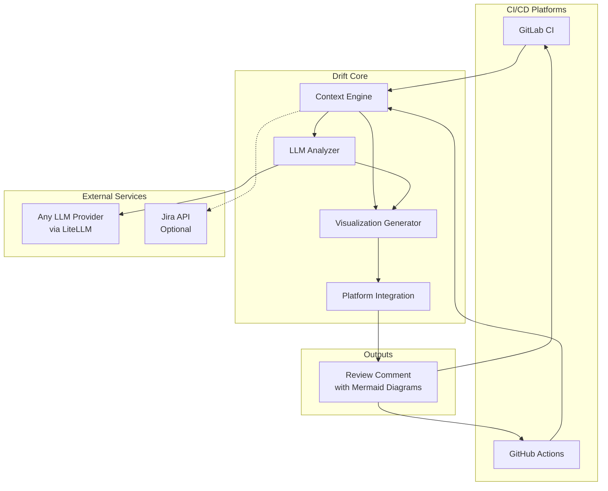
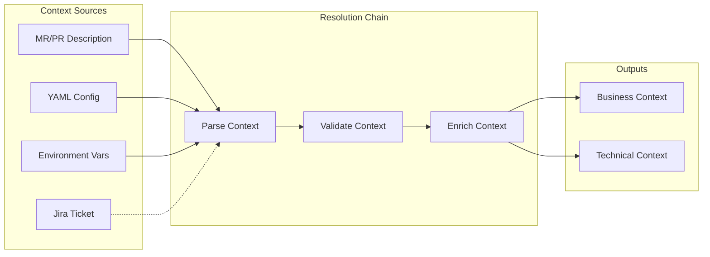
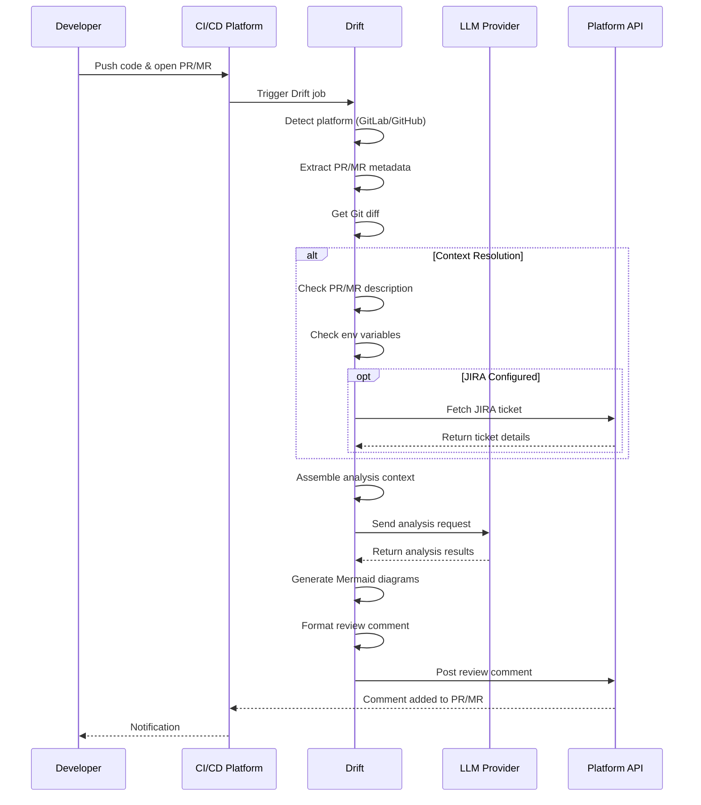

# Drift - Technical Design Document

## 1. System Architecture Philosophy

### 1.1 Design Principles

**CI/CD Native Integration**: Architecture designed for seamless integration with GitLab CI and GitHub Actions, operating as optional pipeline stages.

**LLM Provider Agnostic**: Platform supports any LLM provider through LiteLLM integration, enabling users to choose their preferred AI provider without vendor lock-in.

**Context Flexibility**: Multiple methods for providing context, from manual entry to automated JIRA integration, ensuring architectural analysis always has necessary understanding.

**Security by Design**: All LLM interactions use user-provided API keys, with no data persistence or third-party dependencies.

### 1.2 High-Level Architecture

### 1.3 Core Components

**Context Engine**: Assembles context from multiple sources (PR/MR descriptions, environment variables, optional JIRA)

**LLM Analyzer**: Manages interactions with any LLM provider through a unified interface

**Visualization Generator**: Creates architectural diagrams showing impact of changes

**Platform Integration**: Handles GitHub and GitLab API interactions for posting analysis results

## 2. Technology Stack Rationale

### 2.1 Core Language: Python

- Mature ecosystem for API integrations
- Efficient containerization
- Strong open source community support

### 2.2 LLM Integration Strategy

- Provider-agnostic design supporting any LLM
- Compatible with AI gateways and custom endpoints
- Built-in resilience and error handling

### 2.3 Deployment: Containerized

- Lightweight Docker images
- CI/CD native execution
- Consistent environment across platforms

## 3. Component Design

### 3.1 Context Assembly Engine

**Context Resolution**:
- Prioritized source chain for context gathering
- Support for multiple input formats
- Optional JIRA integration with graceful fallback

### 3.2 LLM Analysis

**Analysis Pipeline**:
- Dynamic prompt construction based on context
- Provider-agnostic LLM communication
- Structured response parsing
- Configurable through environment variables

### 3.3 Visualization Generation

- Creates before/after architectural diagrams
- Uses Mermaid for compatibility with GitHub/GitLab
- Shows component relationships and dependencies

### 3.4 Platform Integration

**GitLab Support**:
- MR comment posting via API
- Native Mermaid rendering support

**GitHub Support**:
- PR comment posting via API
- GitHub-flavored markdown compatibility

## 4. Process Flow

### 4.1 Analysis Flow

### 4.2 Initialization Flow

- Platform detection (GitHub/GitLab)
- Authentication verification
- LLM configuration validation
- Ready state confirmation

## 5. Data Flow

### 5.1 Input Processing
- Platform detection (GitHub/GitLab)
- PR/MR metadata extraction
- Git diff analysis
- Context assembly from multiple sources

### 5.2 Analysis Processing
- Prompt construction with context
- LLM provider interaction
- Response parsing and validation
- Diagram generation

### 5.3 Output Generation
- Platform-specific markdown formatting
- Mermaid diagram embedding
- API-based comment posting

## 6. Security Design

### 6.1 Security Principles

- No credential or data persistence
- User-controlled API keys
- Minimal permission scoping
- Ephemeral processing only

### 6.2 Data Protection

- No storage of code or analysis results
- Environment-based secret management
- Optional sensitive data filtering

## 7. Deployment

### 7.1 Deployment Approach

- Docker container for consistent execution
- Non-blocking CI/CD integration
- Environment-based configuration

## 8. Performance Considerations

- Parallel API calls where possible
- Intelligent diff filtering
- Configurable timeouts
- Rate limit compliance
- Memory-efficient processing

